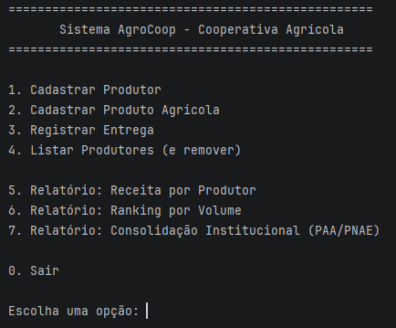
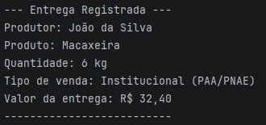
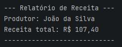

# AgroCoop

A Java-based academic application for managing agricultural producers, products and deliveries, with business rules for pricing and reporting.

The project was developed to practice **Object-Oriented Programming, business logic, exception handling and relational database modeling**.

---

## About the Project

AgroCoop is a terminal-based application designed to support basic operations of an agricultural cooperative.

The system allows users to register producers and agricultural products, record deliveries and generate reports based on the registered data.

The project focuses on applying software development fundamentals through a simple domain-oriented structure.

---

## Features

- Register and remove agricultural producers
- Search producers by name
- Register and remove agricultural products
- Search products by name
- Register product deliveries
- Validate delivery quantities
- Calculate delivery values using different pricing strategies
- Generate revenue reports by producer
- Generate producer rankings by delivered volume
- Generate institutional delivery consolidations

---

## Application Preview

The application uses a menu-driven terminal interface to provide access to the main system operations.

### Main Menu



### Delivery Registration



### Revenue Report



> Screenshots show examples of the terminal-based interface and the main system operations.

---

## Tech Stack

### Programming

- Java
- Object-Oriented Programming
- Interfaces
- Polymorphism
- Collections
- Exception Handling
- Business Rules

### Database

- MySQL
- SQL
- Relational Database Modeling
- Primary and Foreign Keys

> The current Java application manages runtime data in memory.
> The project also includes a MySQL SQL schema designed for future persistent storage.

---

## Project Architecture

The project uses a simple separation of responsibilities:

```text
src/
├── exception/
│   └── Custom exceptions
│
├── main/
│   └── Application entry point
│
├── model/
│   ├── Domain entities
│   ├── Pricing strategies
│   └── Business abstractions
│
└── service/
    └── Business operations
```

This structure helps separate domain models, business operations and exception handling.

---

## Object-Oriented Design

One of the main goals of the project was to apply object-oriented concepts to a real-world domain.

The `Calculavel` interface defines the contract for calculating delivery values:

```java
public interface Calculavel {
    double calcularValor(double quantidade, double precoReferencia);
}
```

Different pricing strategies implement this contract:

- `PrecificacaoPadrao`
- `PrecificacaoInstitucional`

This allows the delivery calculation to use different business rules without changing the `Entrega` class.

The institutional pricing strategy applies an **8% incentive** to the calculated value.

This approach demonstrates the use of:

- Abstraction
- Interfaces
- Polymorphism
- Composition
- Separation of responsibilities

---

## Business Rules

The application implements several domain rules, including:

- Delivery quantities must be greater than zero.
- Deliveries can use standard or institutional pricing.
- Institutional pricing applies an additional 8% incentive.
- Revenue can be calculated per producer.
- Producers can be ranked according to delivered volume.
- Deliveries can be consolidated by agricultural product.

Invalid delivery quantities are handled through a custom exception.

---

## Database

The project includes a relational database schema designed with MySQL.

The main entities are:

```text
Produtor
    │
    └── Entrega
            │
            └── ProdutoAgricola
```

The database contains relationships between:

- Producers
- Agricultural products
- Deliveries

The SQL schema includes:

- Primary keys
- Foreign keys
- Relational constraints
- Delivery pricing types
- Relationships between producers, products and deliveries

### Database Model

The database can be represented conceptually as:

```text
┌───────────────┐
│   PRODUTOR    │
├───────────────┤
│ id_produtor PK│
│ nome          │
│ comunidade    │
│ propriedade   │
└───────┬───────┘
        │
        │ 1:N
        ▼
┌───────────────┐
│    ENTREGA    │
├───────────────┤
│ id_entrega PK │
│ id_produtor FK│
│ id_produto FK │
│ quantidade    │
│ data_entrega  │
│ tipo_precif.  │
└───────┬───────┘
        │
        │ N:1
        ▼
┌──────────────────┐
│ PRODUTO_AGRICOLA │
├──────────────────┤
│ id_produto PK    │
│ nome             │
│ unidade_medida   │
│ preco_referencia │
└──────────────────┘
```

### Current Persistence Status

The SQL database is currently **not connected to the Java application**.

The Java application uses in-memory collections during execution, while the SQL file represents the relational database model prepared for future persistence.

---

## Project Structure

```text
AgroCoop/
├── database/
│   └── banco_agrocoop.sql
│
├── docs/
│   └── images/
│       ├── main-menu.png
│       ├── management.png
│       └── revenue-report.png
│
├── src/
│   ├── exception/
│   ├── main/
│   │   └── Main.java
│   ├── model/
│   │   ├── Calculavel.java
│   │   ├── Entrega.java
│   │   ├── PrecificacaoInstitucional.java
│   │   ├── PrecificacaoPadrao.java
│   │   ├── ProdutoAgricola.java
│   │   └── Produtor.java
│   └── service/
│       └── CooperativaAgricolaService.java
│
├── LICENSE
└── README.md
```

---

## Getting Started

### Requirements

- Java JDK
- Git
- MySQL (optional, for exploring the database schema)

### Clone the repository

```bash
git clone https://github.com/naxt-dev/AgroCoop_projeto.git
cd AgroCoop_projeto
```

### Run the application

Open the project in your preferred Java IDE and run:

```text
src/main/Main.java
```

The application will start a terminal-based menu where you can interact with the cooperative system.

---

## What I Learned

This project helped me strengthen my understanding of:

- Object-Oriented Programming and domain modeling
- Interfaces and polymorphism
- Separation of responsibilities
- Business rule implementation
- Exception handling
- Collection management
- Relational database modeling
- SQL fundamentals

More importantly, the project helped me understand how business requirements can be translated into application logic and structured data.

---

## Future Improvements

Possible improvements for future versions include:

- Connect the Java application to MySQL
- Implement persistent data storage
- Add automated unit tests
- Improve input validation
- Introduce a graphical or web interface
- Develop a REST API with Spring Boot
- Add API documentation
- Containerize the application with Docker

---

## License

This project is licensed under the MIT License.
